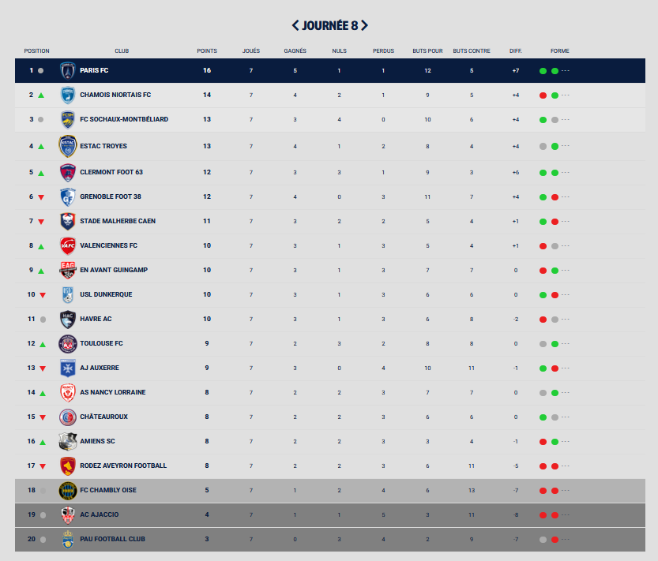
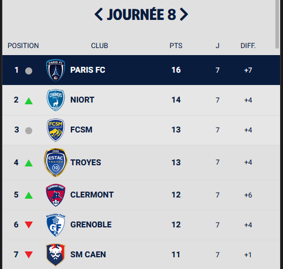

# TP Ligue 2 BKT

> Le TP doit respecter les normes et les standards du WEB (ex. <https://www.w3.org/> et <https://checklists.opquast.com/fr/>)

## Reproduction du classement de la ligue 2 : GO ! Le **Havre AC** !!!

Vous maitrisez maintenant **bootstrap**, votre job, si vous l'acceptez, est de reproduire le tableau de classement suivant :  

  

*Vous devez vous rendre sur le site : <https://www.ligue2.fr/classement> pour récupérer les images.  
**Utilisation du site <https://www.remove.bg/> pour **détourer** vos images.  

## Structure du dossier

Le dossier de ce test sera composé de cette manière :

* index.html
* assets/
    * img/
        * images_du_site
    * css/
        * style.css

## Les fameuses contraintes

* Utiliser majoritairement *des classes bootstrap* : **Votre site doit être responsive**.
* Nous allons prendre comme référence l'iPhone avec une largeur de **414px** (*ex. iPhone 8* Plus)
* Le tableau doit être **optimisé** en mode mobile : *voir ci-dessous*
  
* Le tableau doit bénéficier d'un effet lors du survol de la souris (*surbrillance*) : **Nous devons pouvoir reconnaitre la ligne du tableau lorsque que nous passons la souris dessus.**
* Les images seront à enregistrer dans le dossier du TP **img**.
* Utilisation de l'anglais lors de la création de vos **class** et de vos **id**.
* Un code **propre** avec une belle **indentation** pour plus de lisibilité.

## Un dernier mot

> Objectif : la Ligue 1 ! En avant le HAC !
